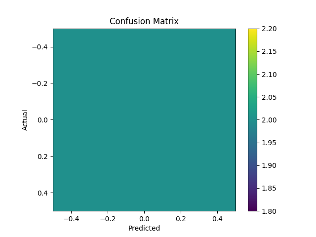

SmartLogix AI is an end-to-end AI-powered logistics and supply chain intelligence system. It predicts product demand levels and delivery ETA using machine learning models, stores predictions for traceability, and provides interactive dashboards for analytics and decision support.
# SmartLogix AI

SmartLogix AI is an intelligent logistics optimization platform that leverages machine learning to predict demand and estimate route ETAs for efficient shipping and supply chain management.

## 📋 Project Structure

```
smartlogix-ai/
├── ai_engine/                    # Machine Learning models and training
│   ├── demand_forecasting/       # Demand prediction models
│   ├── route_eta/                # Route ETA estimation
│   └── utils/                    # Utility functions and encoders
├── backend/                      # FastAPI backend application
│   ├── app/
│   │   ├── api/                  # API endpoints for demand, shipping, health, history
│   │   ├── core/                 # Core configs, database, ML loader
│   │   ├── models/               # SQLAlchemy ORM models
│   │   └── schemas/              # Pydantic schemas
│   └── requirements.txt
├── frontend/                     # Streamlit UI application
│   └── streamlit_app/
├── notebooks/                    # Jupyter notebooks for exploration
├── data/                         # Data storage (raw, processed, samples)
├── docker/                       # Docker configurations
└── vectore_index/                # FAISS vector indexing
```

## 🚀 Getting Started

### Prerequisites
- Python 3.8+
- pip or conda

### Installation

1. **Clone the repository**
   ```bash
   cd smartlogix-ai
   ```

2. **Install Backend Dependencies**
   ```bash
   cd backend
   pip install -r requirements.txt
   cd ..
   ```

3. **Install AI Engine Dependencies**
   ```bash
   cd ai_engine
   pip install -r requirements.txt
   cd ..
   ```

4. **Install Frontend Dependencies** (Optional)
   ```bash
   cd frontend/streamlit_app
   pip install -r requirements.txt
   cd ../..
   ```

### Running the Application

**Start Backend (FastAPI)**
```bash
uvicorn backend.app.main:app --reload --log-level debug
```
The API will be available at `http://localhost:8000`

**Start Frontend (Streamlit)** (Optional)
```bash
streamlit run frontend/streamlit_app/app.py
```

**API Documentation**
- Swagger UI: `http://localhost:8000/docs`
- ReDoc: `http://localhost:8000/redoc`

## 🤖 Components

### AI Engine
- **Demand Forecasting**: Predicts future demand based on historical data
- **Route ETA**: Estimates delivery times for shipping routes
- **Encoders**: Utility functions for feature encoding

### Backend API
- `/health`: Health check endpoint
- `/demand`: Demand prediction endpoints
- `/shipping`: Shipping and shipment management
- `/history`: Historical data and analytics

### Frontend
Interactive Streamlit application for visualization and interaction with the AI models.

## 📦 Docker Support

Build and run using Docker:
```bash
docker build -f docker/backend.Dockerfile -t smartlogix-backend .
docker run -p 8000:8000 smartlogix-backend
```

## 📝 Notes

- Ensure database migrations are set up before running the backend
- Vector indices for FAISS are pre-built and stored in `vectore_index/`
- Training scripts for ML models are available in respective module directories under `ai_engine/`

## 📄 License

This project is proprietary and confidential.
=======
# SMARTLOGIX-AI
SmartLogix AI is an end-to-end AI-powered logistics and supply chain intelligence system. It predicts product demand levels and delivery ETA using machine learning models, stores predictions for traceability, and provides interactive dashboards for analytics and decision support.
>>>>>>> 7199082d14414f36d378aed1834986864cf3de63

## 🏗️ System Architecture

```mermaid
graph TD
    A[Streamlit Frontend] --> B[FastAPI Backend]
    B --> C[AI Engine]
    C --> D[Demand Model - Logistic Regression]
    C --> E[ETA Model - Linear Regression]
    B --> F[(PostgreSQL Database)]
    C --> G[Evaluation Artifacts]


If GitHub doesn’t render Mermaid, use text diagram:

```markdown
## 🏗️ System Architecture

Streamlit (Frontend)
        ↓
FastAPI (Backend API Layer)
        ↓
AI Engine (ML Models)
   ├── Demand Forecasting (Logistic Regression)
   └── ETA Prediction (Linear Regression)
        ↓
PostgreSQL (Prediction & Shipment Storage)
        ↓
Evaluation Layer (Metrics + Confusion Matrix)

## 📊 Model Evaluation

### Demand Forecasting Model (Classification)

- Train/Test Split: 70/30
- Model: Logistic Regression
- Metric: Accuracy, Confusion Matrix

#### Accuracy
See `evaluation/demand_metrics.json`

#### Confusion Matrix


---

### ETA Prediction Model (Regression)

- Train/Test Split: 70/30
- Model: Linear Regression
- Metrics:
  - MAE (Mean Absolute Error)
  - MSE (Mean Squared Error)
  - R² Score

See `evaluation/eta_metrics.json`

## 📈 Why These Metrics?

### Classification (Demand Model)

- **Accuracy**: Measures overall correctness of demand classification.
- **Confusion Matrix**: Provides class-level insight into prediction errors (LOW vs MEDIUM vs HIGH).
- **Classification Report**: Precision, Recall, and F1-score give deeper performance understanding.

### Regression (ETA Model)

- **MAE**: Measures average absolute prediction error in minutes. Easy to interpret operationally.
- **MSE**: Penalizes larger errors more heavily.
- **R² Score**: Indicates how well the model explains variance in delivery time.
